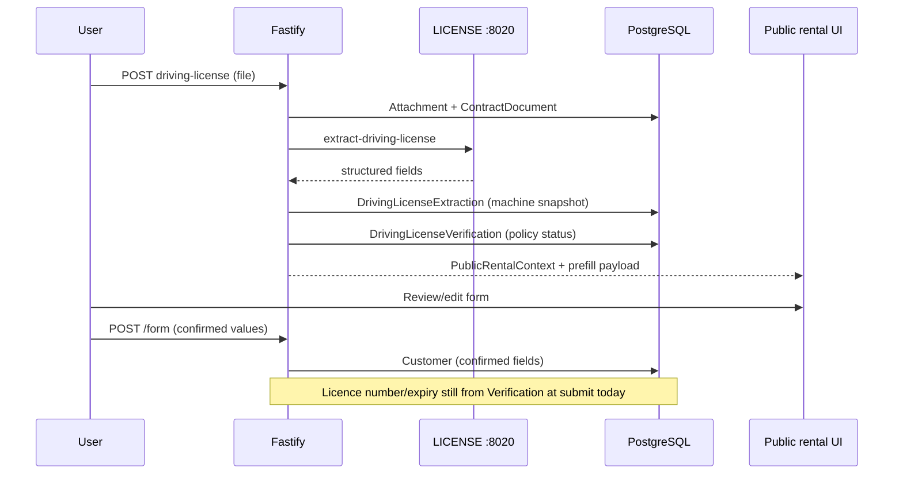

# D-OCR-A3 — Data flow (machine vs human-confirmed)

## Principle

```
OCR = extraction (machine, auditable, editable suggestions)
Form submit = authoritative Customer + contract linkage
Verification status = Diamond policy (expiry, confidence, readability)
```

## Target flow (post B3–B5)



## OCR_DETECTED vs USER_CONFIRMED

| Concern | OCR_DETECTED | USER_CONFIRMED |
|---------|----------------|----------------|
| Storage | `DrivingLicenseExtraction` (+ optional `fieldsMeta`) | `Customer` columns + form snapshot path |
| Official contract | Suggested via identity draft | Name/nationality from Customer/review; licence from verification OCR |
| After user edits | Immutable audit row | Updated Customer on submit |
| Example place | `HAB` in extraction | `ABU DHABI` on Customer after submit |

## Reload / resume

**Today:** prefill data **lost** on refresh (`engineExtraction` not persisted).

**Required:** persist extraction (or denormalized prefill DTO) server-side keyed to **active** `ContractDocument` so `GET /rental/:token` can return `licenseExtraction` / `formPrefill` without re-OCR.

## Future frontend prefill contract (B5)

Per field:

```ts
type PrefillField<T> = {
  value: T | null;
  source: "OCR" | "CUSTOMER" | "NONE";
  ocrStatus?: "ACCEPT" | "REVIEW" | "SKIPPED" | "NOT_OCR_PROCESSED";
  editable: true; // all form fields user-editable unless product says otherwise
};
```

**Precedence on form load:**

1. If Customer exists → show Customer values (confirmed).
2. Else → OCR extraction values for supported fields.
3. Licence number/expiry display may remain verification-driven read-only until product changes.

## Implementation gates

| Phase | Scope |
|-------|--------|
| **B3** | Prisma: `DrivingLicenseExtraction`, Customer nullable fields; persist on upload; GET returns extraction |
| **B4** | Map extraction → `formPrefill` DTO; keep submit mapping; optional extend `PublicFormSchema` |
| **B5** | Frontend autofill + field-level review UX |
| **B6** | Backend + integration tests (fake engine + DB assertions) |
| **B7** | Playwright: upload → prefill → edit → submit → reload |
